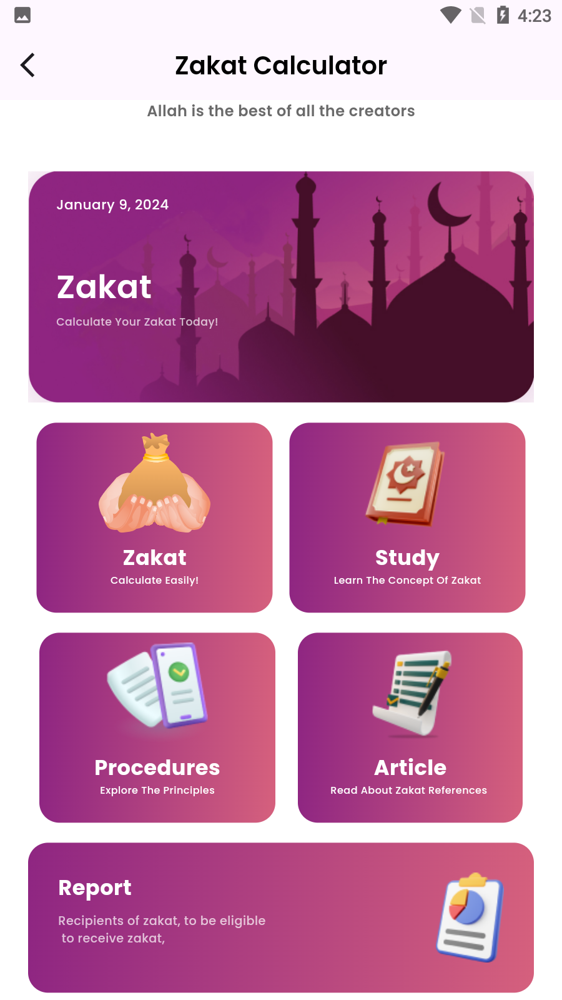

<div align="center">
  <h1>
    <br/>
    Quran App - Your Complete Islamic Companion
  </h1>
  <h3>A Feature-Rich Islamic App with Quran, Prayer Times, Tasbih, Zakat Calculator, and More</h3>
</div>

<p align="center">
    
    
    
</p>

## 📸 Banner
<p align="center">
    
</p>

## 📌 Overview

A comprehensive Islamic app built with Flutter, featuring Quran reading with translations, prayer times, digital tasbih, zakat calculator, Islamic radio, and much more. The app provides a beautiful UI with smooth animations and a complete Islamic lifestyle solution.

## 🚀 Tech Stack

- **Flutter** (UI Framework)
- **GetX** (State Management)
- **Firebase** (Authentication & Database)
- **Cloud Firestore** (Database)
- **Google Maps** (Masjid Finder)
- **Audio Integration** (Quran Recitation)
- **Material Design**
- **Custom Animations**

## 🔑 Key Features

- ✅ **Complete Quran**: With translations and audio recitation
- ✅ **Prayer Times**: Accurate prayer timings with notifications
- ✅ **Digital Tasbih**: Custom dhikr counter with saved collections
- ✅ **Zakat Calculator**: Comprehensive zakat calculation tools
- ✅ **Masjid Finder**: Locate nearby mosques
- ✅ **Islamic Radio**: Listen to Quran recitation channels
- ✅ **Islamic News**: Latest updates from the Islamic world
- ✅ **Duas Collection**: Comprehensive collection of authentic duas
- ✅ **Reading Progress**: Track your Quran reading progress
- ✅ **Beautiful UI**: Modern and intuitive interface

## 📸 Screenshots

### Quran Reading Experience

<table border="1">
  <tr>
    <td align="center">
      
      <p><b>Quran Main Screen</b></p>
    </td>
    <td align="center">
      
      <p><b>Book View</b></p>
    </td>
    <td align="center">
      
      <p><b>Ayah Recitation</b></p>
    </td>
  </tr>
</table>

### Prayer Times & Tools

<table border="1">
  <tr>
    <td align="center">
      
      <p><b>Prayer Times</b></p>
    </td>
    <td align="center">
      
      <p><b>Islamic Tools</b></p>
    </td>
    <td align="center">
      
      <p><b>Masjid Finder</b></p>
    </td>
  </tr>
</table>

### Zakat Calculator

<table border="1">
  <tr>
    <td align="center">
      
      <p><b>Zakat Calculator</b></p>
    </td>
    <td align="center">
      
      <p><b>Zakat Guide</b></p>
    </td>
    <td align="center">
      
      <p><b>Gold Zakat</b></p>
    </td>
  </tr>
</table>

### Digital Tasbih & Duas

<table border="1">
  <tr>
    <td align="center">
      
      <p><b>Add New Tasbih</b></p>
    </td>
    <td align="center">
      
      <p><b>Saved Tasbih</b></p>
    </td>
    <td align="center">
      
      <p><b>Duas Collection</b></p>
    </td>
  </tr>
</table>

### Islamic Radio & News

<table border="1">
  <tr>
    <td align="center">
      
      <p><b>Radio Player</b></p>
    </td>
    <td align="center">
      
      <p><b>Islamic News</b></p>
    </td>
    <td align="center">
      
      <p><b>News Detail</b></p>
    </td>
  </tr>
</table>

## 📱 Download APK

Download the latest version:
[APK/app-armeabi-v7a-release.apk](APK/app-armeabi-v7a-release.apk)

## Project Struture


```
lib/
├── controllers/
│ ├── prayer_controller.dart
│ ├── quran_controller.dart
│ └── user_controller.dart
├── models/
│ ├── user_model.dart
│ └── reading_model.dart
├── views/
│ ├── Home/
│ ├── Quran/
│ ├── Tasbih/
│ ├── Zakat/
│ └── Profile/
├── utils/
│ └── static_data.dart
└── main.dart
```

## 🎯 Features Coming Soon

- Offline Quran database
- Multiple translations
- Community features
- Prayer reminders
- Advanced bookmarking
- Multi-language support

## 🔧 Settings & Customization

- Reading preferences
- Audio settings
- Prayer time calculation methods
- Theme customization
- Notification settings
- Profile management

## 📖 How to Use

1. **Quran Reading**
   - Browse by Surah or Juz
   - Listen to recitations
   - Track reading progress

2. **Prayer Times**
   - View daily prayer times
   - Get notifications
   - Find nearby mosques

3. **Zakat Calculator**
   - Calculate different types of zakat
   - View detailed guides
   - Save calculations

4. **Digital Tasbih**
   - Create custom dhikr counters
   - Save favorite collections
   - Track daily dhikr

## 🤝 Contributing

Contributions are welcome! Please feel free to submit a Pull Request.

## 📁 Project Structure

